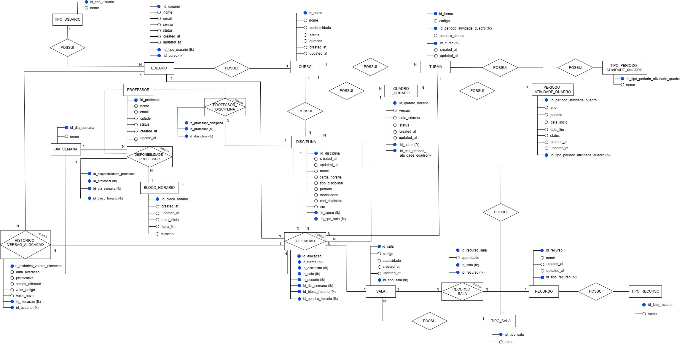

# DOCUMENTAÇÃO - Projeto Integrador AMS

### Mural da Documentação

  📔 <a href="https://docs.google.com/document/d/1TkenqD_ETDKl2ds3NEgFwS4CTYoZlIDhZGbddxWUcG4/edit?usp=sharing" target="_blank">Documentação</a> 
  📕 <a href="https://docs.google.com/document/d/1kIHQMW-u1-bhhyOc55NTBMfhFxIJFVr9m3ss7-XeX3E/edit?usp=sharing" target="_blank">Requisitos Funcionais</a> 
   
  🎲<a>DER</a> 
   
  *Em caso de dúvida o dicionário de dados pode ser acessado na documentação

  👤 <a>Use Case</a> disponível no repositório 
  📁 <a>Diagrama de Classes (Em andamento)</a> 

---
